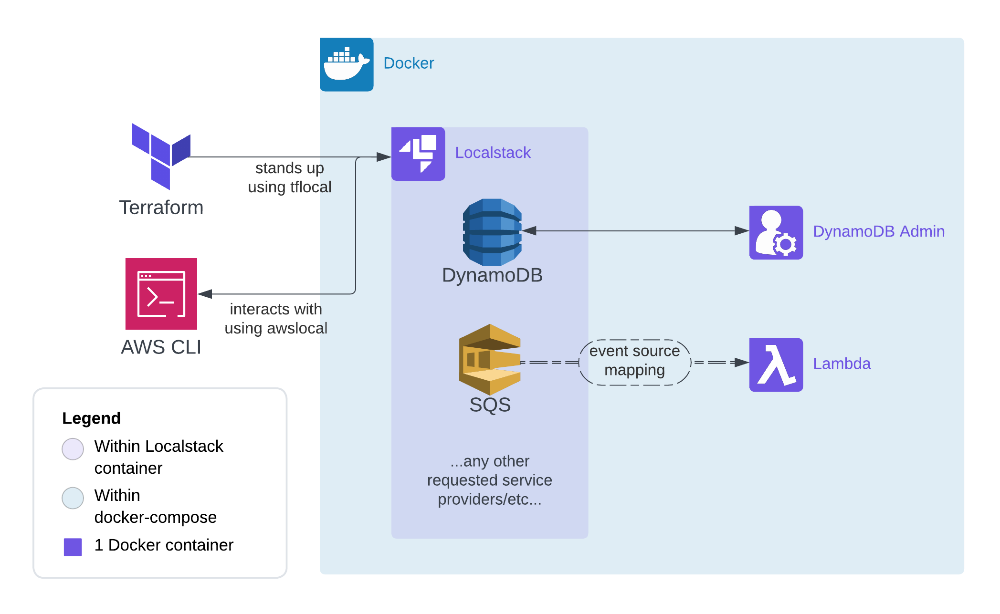

# :rocket::mountain: localstack-terraform-demonstration

Want to be able to test your code by _leveraging AWS resources locally?_ 
Confirm the impact of configurations and _IaC you've expressed with [Terraform](https://www.terraform.io)?_ 

[Localstack](https://github.com/localstack) aggregates various service providers that implement emulations of the AWS APIs. It also supports various [IaC integrations](https://docs.localstack.cloud/user-guide/integrations/terraform/) to spin up requested infrastructure in an automated fashion.

This demo provides a skeleton of various AWS resources in Terraform to test or build off of, and a docker-compose with Localstack and [dynamodb-admin](https://github.com/aaronshaf/dynamodb-admin) for easy DB management.

### Architecture



The base Terraform script without any modification will stand up an SQS queue, a Lambda which has an event source mapping from the 
queue, and a DynamoDB table.

The demo flow goes as follows:
1. Write a message to our input SQS queue
2. Localstack's event source mapping handler will acknowledge receipt of the message and spin up a separate container to emulate the Lambda
3. The Lambda will wrap the incoming message body with a corresponding ID and timestamp and then persist this record to our output DynamoDB table

### Usage
#### Pre-steps
1. Install [Terraform](https://developer.hashicorp.com/terraform/tutorials/aws-get-started/install-cli) to actually execute the pre-provided Terraform script or your own
2. Install [terraform-local](https://pypi.org/project/terraform-local/) with pip to get a Terraform wrapper macro, `tflocal`, which points your Terraform commands to our Localstack
3. Install [awscli-local](https://pypi.org/project/awscli-local/) with pip to get an AWS CLI wrapper macro, `awslocal`, which points your AWS CLI commands to our Localstack
4. (If wanting to make changes) Modify this repo's main.tf Terraform script to add your intended AWS resources

#### Execute
1. Stand up the containers with: `docker-compose up`
2. Apply your Terraform infrastructure to the Localstack container with:
```
tflocal init
tflocal apply
```
3. Once changes are applied, you can use `awslocal` replacing any `awscli` command to test your infrastructure!

At this point, if you wish to test our demo flow functionality:
1. Submit a message to the input queue with: `awslocal sqs send-message --queue-url http://localhost:4566/000000000000/input_queue --message-body "Any message can go here!"`
2. Confirm in your Docker Desktop that a lambda container has been spun up and/or that the Localstack container has acknowledged receiving the message
3. Confirm via dynamodb-admin that the event was persisted to our output table by accessing the UI at: http://localhost:8001

### Next Steps
Try forking this repo and add more AWS resources using the [Terraform docs](https://registry.terraform.io/providers/hashicorp/aws/latest/docs) as a guide!

Be mindful though, Localstack doesn't guarantee full AWS API coverage for all resources, so check their [feature coverage table](https://docs.localstack.cloud/user-guide/aws/feature-coverage/) to confirm that they support any resources that you're adding.
